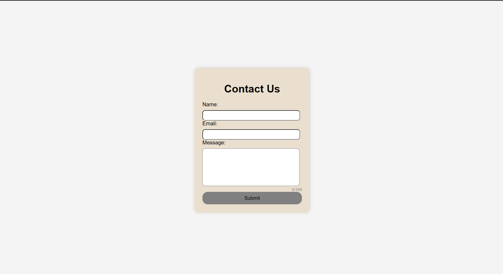

# Task_6

# 📩 Contact Form with JavaScript Validation

A simple and responsive contact form built using HTML, CSS, and JavaScript with client-side validation and user-friendly feedback.

## 🚀 Features

- ✅ Name, Email, and Message validation  
- ✅ Regex-based email validation  
- ✅ Real-time (live) validation while typing  
- ✅ Dynamic error messages  
- ✅ Character counter for message (max 200)  
- ✅ Submit button disabled until form is valid  
- ✅ Success message on submission  
- ✅ Clean and responsive UI  

## 🛠️ Tech Stack

- HTML5  
- CSS3  
- JavaScript (Vanilla JS)  

## 📂 Project Structure
 │── index.html
 │── style.css
 │── script.js

 
## Screenshot

## 📸 How It Works

1. User enters Name, Email, and Message  
2. Inputs are validated in real-time  
3. Errors are shown below fields if invalid  
4. Submit button is enabled only when all inputs are valid  
5. On submit → success message is displayed  

## 🧠 Concepts Used

- DOM Manipulation  
- Event Handling  
- Form Validation  
- Regular Expressions (Regex)  
- User Experience (UX) Improvements  

## ⚠️ Validation Rules

- Name → Cannot be empty  
- Email → Must follow valid email format  
- Message → Cannot be empty (max 200 characters)  

## 📌 Future Improvements

- Add backend (Node.js / Express)  
- Store messages in database  
- Add animations and better UI  
- Convert to React version  

